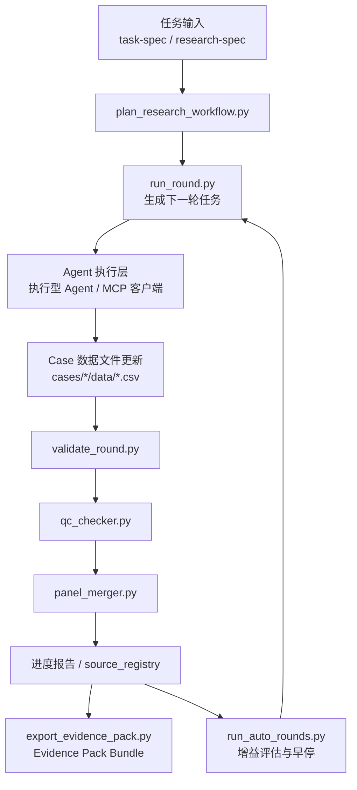
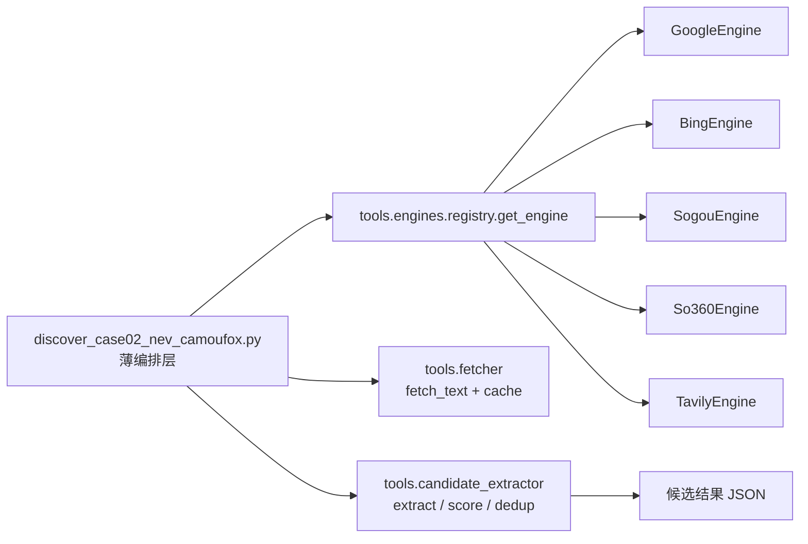
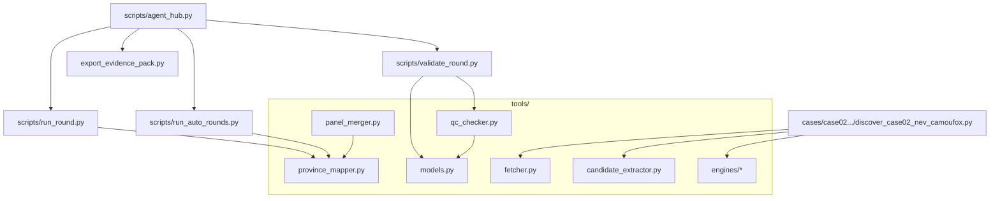

# Academic Data Hunter 架构说明

本文档描述项目核心模块、数据流与扩展点，便于后续维护和开源协作。

## 1. 端到端数据流

## 2. 搜索引擎抽象层（Case02）

## 3. 模块依赖关系

## 4. 设计原则

1. **脚本编排、工具纯逻辑分离**：`scripts/` 负责流程，`tools/` 负责可复用能力。  
2. **Case 代码就近管理**：案例专属脚本放在 `cases/<case>/scripts/`。  
3. **输入先校验再处理**：使用 Pydantic 模型约束关键字段。  
4. **可审计优先**：每次自动化轮次都要可追溯（任务文件、报告、台账）。  
5. **可扩展搜索层**：新增搜索引擎只需实现 `SearchEngine` 并注册到 `registry`。  
6. **交付物优先**：最终输出不止是 CSV，还应包含 `source_registry` 与 `evidence pack`。  

## 5. 运行模式

- **本地脚本模式**：直接调用 `python scripts/*.py`
- **Hub API 模式**：`python scripts/agent_hub.py serve ...`
- **容器模式**：见仓库根目录 `Dockerfile` 和 `docker-compose.yml`
- **Evidence Pack 模式**：`python scripts/export_evidence_pack.py ...`
